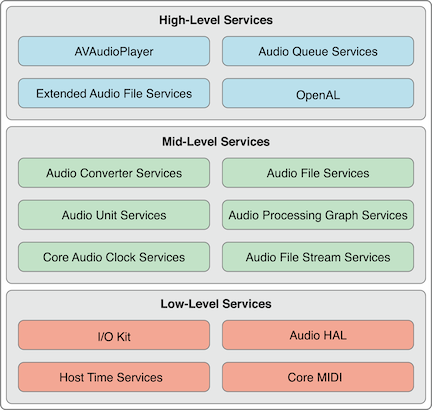

# Audio Playback in iOS

Note in read [「Audio Playback in iOS」](http://msching.github.io/blog/2014/07/07/audio-in-ios/)

经典的音频播放流程（以MP3为例）

1. 读取MP3文件
2. 解析采样率、码率、时长等信息，分离MP3中的音频帧
3. 对分离出来的音频帧解码得到PCM数据
4. 对PCM数据进行音效处理（均衡器、混响器等，非必须）
5. 把PCM数据解码成音频信号
6. 把音频信号交给硬件播放
7. 重复1-6步直到播放完成

