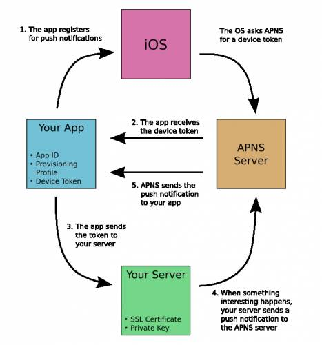
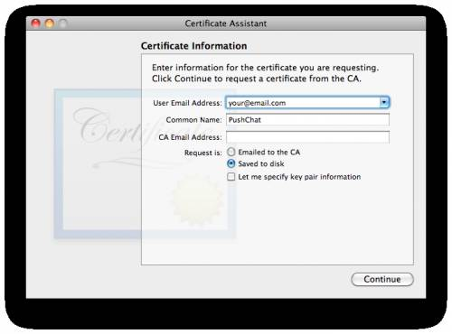
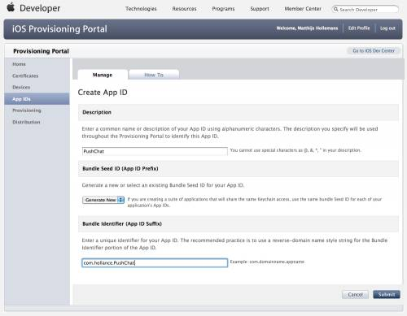
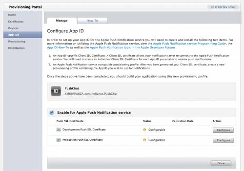
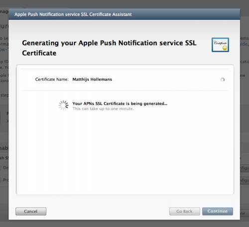
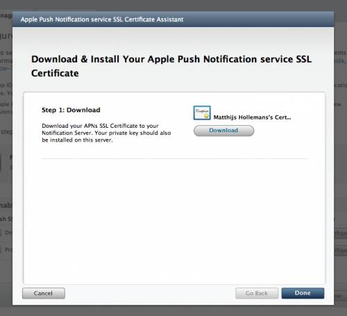

[check Source](http://www.cnblogs.com/gpwzw/archive/2012/03/31/Apple_Push_Notification_Services_Tutorial_Part_1-2.html "Permalink to 苹果推送通知服务教程 Apple Push Notification Services Tutorial - 风雨雷电堂")

#  Apple Push Notification Services Tutorial

## 目录

- [基本框架](#基本框架)
- [苹果推送通知服务的目的](#苹果推送通知服务的目的)
- [推送通知格式](#推送通知格式)
- [正式开始之前](#正式开始之前)
- [配置文件和证书](#配置文件和证书)
- [准备证书申请文件](#CertificateSigningRequest)
- [准备应用ID（App ID）和SSL证书](#appid_ssl)
- [制作PEM文件](#制作PEM文件)
- [准备配置文件](#准备配置文件)
- [简单的示例应用](#简单的示例应用)
- [发送推送通知](#发送推送通知)

在iOS系统，考虑到手机电池电量，应用不允许在后台进行过多的操作，当用户未开启应用时，要怎么样才能通知用户呢？好比用户收到一个新的微博、喜欢的球队取得一场胜利或者是晚餐准备好了，如果应用都不在运行当中，当然也就无法去获得这些事件。

幸运的是苹果提供一个解决方案，通过你自己的服务组件来替代应用持续地检查事件或在后台进行类似的操作，当事件实时发生时，服务组件能发送通知给应用，通过下列三种方式提醒用户：显示简短的文本作息，播放提示音，在应用图标上显示数字提示（就是红色背景的那个）你可以把这三种方式随便地组合使用，比如播放声音并显示一个提示数字而已。

初学者请在先选择一些初级教程：

目录：[raywenderlich.com/tutorials](http://www.raywenderlich.com/tutorials)

特别是这两篇：

- [How To Write A Simple PHP/MySQL Web Service for an iOS App](http://www.raywenderlich.com/2941/how-to-write-a-simple-phpmysql-web-service-for-an-ios-app)
- [How To Write an iOS App That Uses A Web Service](http://www.raywenderlich.com/2965/how-to-write-an-ios-app-that-uses-a-web-service)

## 基本框架

要让苹果推送通知服务正常工作，涉及很多方面，下图是一个基本框架：



1. 应用启用推送通知功能，需要用户确认
2. 应用收到设备识别ID（device token），相当于接收推送通知的地址
3. 应用将设备识别ID发送到你开发的服务器
4. 当有推送通知的需要时，你就可以通过你开发的服务组件发送信息到苹果的服务器上
5. 苹果推送通知服务将信息推送到用户的设备上

用户设备接收到推送信息时，显示提示信息或播放提示音或更新主屏图标的提示数字，用户可以从提示信息窗口打开应用程序，应用可以根据提示信息的内容作进一步的处理。iOS4支持本地通知和后台多任务，是否我们就不需要推送通知了呢？答案是否定的，本地通知仅限于周期性定时事件处理，后台多任务也仅限于一些必须保持运行的应用，比如IP语音、后台音乐播放、导航等，如果你需要在你的应用关闭时提醒你的用户，你就必须使用推送通知服务

## 苹果推送通知服务的目的

在你的应用中增加苹果推送通知服务有以下几项准备工作：

- 苹果推送通知服务不能在模拟器上工作，你必须在真机上测试
- 在苹果开发者门户（iOS Provisioning Portal）新增一个新的应用ID、对应的配置文件（provisioning profile）、专属于的SLL认证证书；创建自己的配置文件和证书，获取认证证书是很慎重的过程，必须按照规定执行，后文中有详细的操作步骤；
- 一台联入互联网的服务器，苹果推送通知服务是在互联网上工作，开发时你可以在你的工作站上测试，但是实际使用时，你至少需要一台虚拟个人服务器，但是要保证可以安装证书，并开放相应的端口与苹果的服务器建立安全套接字（TLS）网络连接，一般IDC虚拟空间提供商不会提供此类额外服务，请先与你的供应商确认这些细节；

## 推送通知格式

一个推送通知包括设备识别ID，通知主体和一些标识字节，通知主体是我们要发送的内容。首先我们得按JSON格式组织好通知主体，下面是一个最简单的示例：

    {"aps":{"alert":"测试信息","sound":"default"}}

用大括号｛｝将键值对（字典对象）封装起来，有点像NSDictionary。通知主体至少得包括一个项目："aps"，这个项的内容还是一个字典对象，在上面这个示例中，"aps"包括两个字段：alert和sound，让设备收到这个推送通知时，设备会弹出一个提示窗口，内容是测试信息，同时播放标准的提示声音。在aps这个字段下我们还可以自定义一些内容：

    {"aps":{"alert":{"action-loc-key":"Open","body":"Hello, world!"},"badge":2}}

在这个示例中，字段"alert"也变成一个字典对象，字段"action-loc-key"重新定义弹出提示窗口中确认按钮上的文字，"badge"字段是需要在主屏图标上显示的提示数字，这个示例没有播放声音。还有很多通知主体内容的设置方式，你可以改变播放的声音，可以根据本地语言化的调置提供本地化的提示文字，甚至于加上你自定义的字段内容。更多资料请移至官方[《本地和推送通知开发指引（英）》](http://developer.apple.com/library/ios/#documentation/NetworkingInternet/Conceptual/RemoteNotificationsPG/Introduction/Introduction.html)

出于效率的考虑，推送通知的字节长度不能超过256个字节，类似于短信或推特（微博），所以在组织JSON通知主体内容时，一般我们都不保留换行和空格：

    {"aps":{"alert":"Hello, world!","sound":"default"}}

这样已经很清楚了，不是吗，超过256个字节的推送通知，苹果的服务器可是会自动过滤掉的。

## 正式开始之前

推送通知不保证发送接收的可靠性,就算APNS接收发送的请求，推送通知的接收也是没有保证的。没有办法确认推送通知发送的状态和接收与否，发送时间也无法得到保证，可能几秒也可以半小时。如果用户设备通过受限的局域网在线或处于关机状态，也是收不到推送通知的。APNS会尝试在设备重新上线时发送最后一条推送通知，但是这种尝试不会持续太长时间，之后推送通知就永远失效了。别指望在APNS里查找历史记录

只要监控你网站上的更新，并发送通知到你的用户是比较简单的，但是如果你提供的功能包括自定义监控其他网站的更新时，你的服务器要能够运行得了可能远超过你估计的监控任务。所以你还必须从维护成本上考虑你的应用是否需要这功能。

## 配置文件和证书


应用配置文件分为开发和发布两种类型，推送配置文件也有两种：

- 开发（Development）.对应着你开发测试时用的应用配置文件
- 发布（Production）.对应着你正式发布时用的应用配置文件

<a name="CertificateSigningRequest"></a>
## 准备证书申请文件（Certificate Signing Request）

数字证书基于公私钥加密方式，数字证书总是和个人私钥文件合并使用。证书是公钥的部分，用于建立基于SSL的加密网络连接，并不需要高强度的保密，而私钥不同，这是"私的"，你需要好好地保存。

要申请数字认证，你需要先准备一个证书申请文件（CSR），准备好后会在"钥匙串"程序（MAC OS）中生成一个新的私钥项目，把证书申请文件发给证书发放方（这里是苹果开发者门户），你将可以获取一个对应的SSL证书。

在你的MAC电脑上的「应用程序/实用工具」下打开"钥匙串访问"程序（Applications/Utilities/Keychain Access），在「Keychain Access/Certificate Assistant」菜单中选择「Request a Certificate from a Certificate Authority…」


如果你没有找到这个菜单项或是提示"Request a Certificate from a Certificate Authority with key"，你还需要额外在开发者门户里下载并安装[WWDR Intermediate Certificate](https://developer.apple.com/certificationauthority/AppleWWDRCA.cer)

确认没有选中窗口列表中的任何私钥，你应该可以看到以下窗口：



输入你的邮件地址，虽然有人建议说最好是跟开发资格的用户一致，但是看起来不一样也没有关系。

输入PushChat（示例应用名称）在common name 项，实际上随便你填什么，只要你到时能够通过命名找到你的私钥就行。

选择「保存在本地磁盘（Saved to disk）」，将CSR保存为"PushChat.certSigningRequest"。

现在你在"钥匙串访问"程序中Keys分类下应该可以找到一个新的私钥项目，右击并选择Export。


将私钥保存为文件，保存时会提示你输入口令，命名为"PushChatKey.p12"。

为了方便在本教程里引用，我使用"pushchat" 作为口令，实际应用时应该使用高强度的密码口令。可不能忘记口令，否则后面你可能无法访问私钥文件。

<a name="appid_ssl">
## 准备应用ID（App ID）和SSL证书

登入[苹果开发者门户](https://developer.apple.com/ios/manage/overview/index.action)

首先，我们先填写一个新的应用ID，每个推送通知服务都对应着唯一的应用，在这里，你不能使用通配符。

在左项菜单中选择APP IDs，点击按钮【New App ID】。



填写如下：

- Description: PushChat
- Bundle Seed ID: Generate New (this is the default option)
- Bundle Identifier: com.hollance.PushChat

这里你得填上自己的标识：com.yoursite.PushChat，因为你在XCODE得用同样的标识开发应用。

稍等一会，你就可以生成对应这个APP的SSL证书，你的服务组件通过这个证书也只能发送通知到这个APP。

填写完毕，你应该可以看到下列信息：


在「Apple Push Notification service」列，有两行有橙色小圆点起始的信息：「Configurable for Development」 和「Configurable for Production」 这就意味着这个应用ID已经准备好了，接下来设置相关的选项。点击「Configure」链接



点选「Enable for Apple Push Notification service」框，点击对应「Development Push SSL Certificate」的设置按钮「Configure」，弹出 苹果推送服务SSL证书助理（Apple Push Notification service SSL Certificate Assistant）窗口 :


首先提示你准备好证书签名申请文件，我们上面已经准备好了，点击继续，在下一步中进行上传CSR文件的操作，选中之前生成的CSR文件然后点击生成（Generate）。



生成证书需要几秒钟，接着点继续按钮（Continue）



下载生成的证书并保存为"aps_developer_identity.cer"。点击完成按钮（Done）关闭助理窗口返回APP ID界面。

)

已经激活开发用的证书认证，如果需要你可以在这里重新下载证书，开发证书的有效期为3个月。要正式发布你的应用的时候，必须在发布认证那一项目下把这个过程重新来一遍。

备注：发布认证的证书有效期为一年，你必须在到期前重新生成一次来保证你的系统正常运行。

<a name="制作PEM文件"></a>
## 制作PEM文件

现在我们有三个文件：

- 认证签名申请文件（CSR）
- 私钥文件（PushChatKey.p12）
- SSL证书文件（aps_developer_identity.cer）

妥善地保存好这三个文件，特别是CSR文件，在你的证书失效之后，你可能会再次用到它来申请证书。原来的私钥还可以用，只有SSL证书文件是新的。

我们需要转换证书和私钥文件为一种常用格式，示例中我们使用PHP开发服务组件，我们需要把证书和私钥文件合并为PEM格式文件。我们不用关心是哪一种具体的PEM编码格式（实际上我也不是很清楚），关键是PHP可以用来与服务器建立有效的网络连接，其他的编程语言可能会用到其它格式的文件。我们用MAC电脑的命令行工具OpenSSL来操作，打开一个"终端"（Terminal）程序：通过cd命令转到存放三个文件的文件夹

转换证书&nbsp;.cer 文件到 .pem 文件格式：

    $ openssl x509 -in aps_developer_identity.cer -inform der -out PushChatCert.pem

转换私钥 .p12 文件 到 .pem 文件格式:

    $ openssl pkcs12 -nocerts -out PushChatKey.pem -in PushChatKey.p12
    EnterImportPassword:
    MAC verified OK
    Enter PEM pass phrase:Verifying-Enter PEM pass phrase:

在这里，你首先要输入私钥文件的口令以便访问.p12文件，接着要求输入一次新的口令来加密新的PEM文件，这里我们都用"pushchat" ，你也可以使用更复杂的口令来保护你的私钥。

备注：如果你不输入一个6位以上的加密口令，openssl工具将给出错误信息并取消操作。

最后，我们把这两个文件合并成一个 .pem 文件：

    $ cat PushChatCert.pem PushChatKey.pem > ck.pem

测试一下证书是否正常：

    $ telnet gateway.sandbox.push.apple.com 2195 
	Trying17.172.232.226...
	Connected to gateway.sandbox.push-apple.com.akadns.net.Escape character is...

这里是生成一个普通的网络连接，如果有上面的信息，说明你的电脑可以联上APNS服务器，按Ctrl+C关闭连接。如果有问题，你需要检查一下网络和防火墙的端口2195的设置

这次我们试一试用私钥和证书进行SSL加密连接：

    $ openssl s_client -connect gateway.sandbox.push.apple.com:2195 -cert PushChatCert.pem -key PushChatKey.pem
    Enterpass phrase forPushChatKey.pem:

你应该可以看到接下来的整个输出,如果连接成功，你可以输入几个字符，当你按下回车，连接就断开了，连接失败的话也会有提示信息。

特别提示你有两个不用的APNS服务器，一个用于测试的沙盒服务器，一个用于正式使用的服务器，我们制作的证书是用于测试的，所以上面的示例中我们使用的是沙盒服务器的地址。

## 准备配置文件

开发者门户上的操作还没有完，点击左项菜单上的「Provisioning」，点击「New Profile」新建一个配置文件。


填入如下内容：

- 配置名称Profile Name: PushChat Development
- 证书（Certificates）:选中你的开发者证书
- 应用ID（App ID）: PushChat
- 设备（Devices）: 选中你的开发设备

这里的操作跟你之前的没有什么不用，只是具备推送功能的应用需要一个新配置文件来跟设置好的APP对应起来。点击发送按钮（Submit），新的配置文件就会重新生成，稍等片刻，再刷新页面即可下载新的配置文件（PushChat_Development.mobileprovision）。将配置文件下载并加载到XCode（双击或拖到XCode图标上）。准备正式发布前，你也要这样操作来准备用发布用的配置文件。

## 简单的示例应用

打开你的XCode，选择「File」「New Project」，选择「View-based Application」点击继续：


填入以下内容：

- Product Name: PushChat
- Company Identifier: com.hollance
- Device Family: iPhone

根据你的实际情况填入应用名称和开发者标识，这里我们就填入"com.hollance.PushChat"。你应该填入跟你在开发者门户里填入的一致信息(com.yourname.PushChat)。

完成新建项目的操作，打开PushChatAppDelegate.m，修改 didFinishLaunchingWithOptions 过程：

```objective-c
-(BOOL)application:(UIApplication*)application didFinishLaunchingWithOptions:(NSDictionary*)launchOptions {
	self.window.rootViewController = self.viewController;[self.window makeKeyAndVisible];
	// 通知设备需要接收推送通知 Let the device know we want to receive push notifications
	[[UIApplication sharedApplication] registerForRemoteNotificationTypes:(UIRemoteNotificationTypeBadge|UIRemoteNotificationTypeSound|UIRemoteNotificationTypeAlert)];
	return YES;
}
```

调用`registerForRemoteNotificationTypes`通知系统应用是需要接收推送信息的。

在你的设备上编译运行应用，模拟器是不支持推送信息的。XCode应该会自动选择配置文件，如果出现签名错误，你需要在`Code Signing build settings`手动选择之前下载的配置文件。应用启动时会注册推送通知服务，弹出下面的确认窗口提示用户允许此应用接收推送通知服务


应用只会提示询问一次，如果用户选择接受，设备就一切就绪了。如果用户选择了拒绝，应用将永远无法接收到信息，用户可以在设备的设置项目中修改此项设定。


应用的名称将会添加到设置程序中的通知项目下，用户可以方便地在这里开启或关闭或自定义接收信息的种类和方式


应用也可以通过程序来激活具体的提示方式：

    UIRemoteNotificationType enabledTypes = [[UIApplication sharedApplication] enabledRemoteNotificationTypes];

还有额外的一件事，为了发送信息到指定的手机，我们还需要一些操作：

    -(void)application:(UIApplication*)application didRegisterForRemoteNotificationsWithDeviceToken:(NSData*)deviceToken {
		NSLog(@"我的设备ID: %@", deviceToken);	
	}
	
	-(void)application:(UIApplication*)application didFailToRegisterForRemoteNotificationsWithError:(NSError*)error
    	{NSLog(@"注册失败，无法获取设备ID, 具体错误: %@", error);
	}

当应用注册推送服务成功时，就可以获取用户设备识别ID（Token ID），这是对应你的设备一个32位的唯一编码，你可以理解为推送信息的地址。运行应用，在XCode的终端窗口你可以看到我的设备ID

设备识别ID（Token ID）是加密的数据结构，储备在NSData对象中。这里你知道它是32位长度就够了，上面你看到的是64个16进制的字符，我们将使用这个格式，当然和空格要过滤掉。

在模拟器中运行，didFailToRegisterForRemoteNotificationsWithError会返回错误：method will be called as push notifications are not supported in the simulator.

## 发送推送通知

这里有一个简单的PHP脚本用来建立到APNS的连接和发送测试信息到之前的设备上。你可以在MAC上直接使用：

[下载SimplePush源代码](http://d1xzuxjlafny7l.cloudfront.net/downloads/SimplePush.zip)或者「github下载」(./SimplePush/)修改simplepush.php中的以下几个地方：

    // Put your device token here (without spaces):
    $deviceToken ='0f744707bebcf74f9b7c25d48e3358945f6aa01da5ddb387462c7eaf61bbad78';
	// Put your private key's passphrase here:
    $passphrase ='pushchat';
	// Put your alert message here:
    $message ='My first push notification!';

复制设备识别ID到变量$deviceToken，别留下任何一个空格，完完全全就是64个16进制字符；指定私钥的口令和要发送的信息内容；复制ck.pem到脚本所在文件夹，ck.pem包括了证书和私钥。

开启终端程序（ Terminal）：

    $ php simplepush.php

如果一切OK的话，脚本将返回：

    Connected to APNS
    Message successfully delivered

几秒钟内，你应该可以在设备上收到推送的信息了。


**注意**:如果应用在开启运行状态的话，你看不到任何信息，信息被直接发送给应用本身，但是我们还没有通过编程来处理收到的信息，不信你可以再试一下。

如果PHP脚本退出并返回错误信息，请检查PEM文件是否正确、连接沙盒服务器是否正常